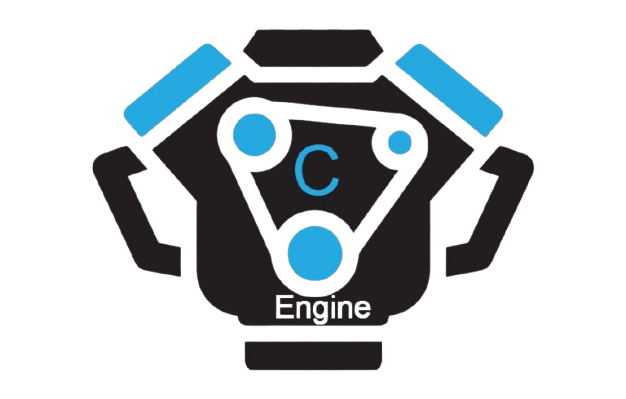

[](https://gitHub.com/Da4ndo/CEngine/releases/)
[](https://github.com/Da4ndo/CEngine/blob/master/LICENSE)
[](https://GitHub.com/Da4ndo/CEngine/issues/)
[](http://makeapullrequest.com)
[](https://github.com/Da4ndo/CEngine)



# CEngine

CEngine (Convert Engine) is a powerful Rust-based tool for converting Python scripts into standalone executables.

## Overview

CEngine is an **open-source** converter that streamlines the process of creating executables from Python scripts. It handles the entire workflow automatically:

- Creates a virtual environment
- Analyzes and detects required packages
- Installs dependencies
- Builds the executable
- Cleans up temporary files

## Features

- **Smart Import Detection**: Automatically scans your Python script to identify required packages
- **Virtual Environment Management**: Creates and configures isolated environments for clean builds
- **Dependency Resolution**: Handles package installation, including special cases like PyWin32 and OpenCV
- **Build Optimization**: Creates optimized executables with minimal size
- **Automatic Cleanup**: Removes temporary build files after completion
- **Cross-Platform Support**: Works on Windows, macOS, and Linux
- **Debug Mode**: Detailed logging for troubleshooting
- **Force Mode**: Override warnings and proceed with operations

## Installation

### From GitHub Releases

#### Windows
1. Download the latest Windows executable from the [Releases page](https://github.com/Da4ndo/CEngine/releases)
2. Download `cengine-windows-x64.exe`
3. Add the executable to your PATH or run it directly

#### Linux
1. Download the latest Linux binary from the [Releases page](https://github.com/Da4ndo/CEngine/releases)
2. Download `cengine-linux-x64`
3. Make it executable:
   ```bash
   chmod +x cengine-linux-x64
   ```
4. Move it to a directory in your PATH:
   ```bash
   sudo mv cengine-linux-x64 /usr/local/bin/cengine
   ```

### Arch Linux (AUR)

For Arch Linux users, CEngine is available in the AUR:

#### Using yay
```bash
yay -S cengine
```

#### Using paru
```bash
paru -S cengine
```

#### Manual installation from AUR
```bash
git clone https://aur.archlinux.org/cengine.git
cd cengine
makepkg -si
```

## Usage

```bash
CEngine (Convert Engine) is an open-source converter for Python to create exe from py files.

Usage: cengine <SCRIPT> [OPTIONS] [PYINSTALLER_ARGUMENTS]

Arguments:
  [SCRIPT]  Define a script to be made into an executable

Options:
  -n, --name <NAME>                Define the script name
      --add-imports <IMPORTS>...   Add more imports
      --force-platform <PLATFORM>  Add custom arguments
      --clean                      Clean failed builds
      --debug                      Sets the debug environment to true
      --force                      Forces the operation to proceed with all warnings and skippings
  -h, --help                       Print help
  -V, --version                    Print version
```

### Basic Usage

```bash
cengine test.py
```

##### With name:
```bash
cengine test.py --name test
```

##### With custom arguments:
```bash
cengine test.py --force-platform linux --add-imports numpy
```

##### Clean failed build:
```bash
cengine test.py --name test --clean
```


